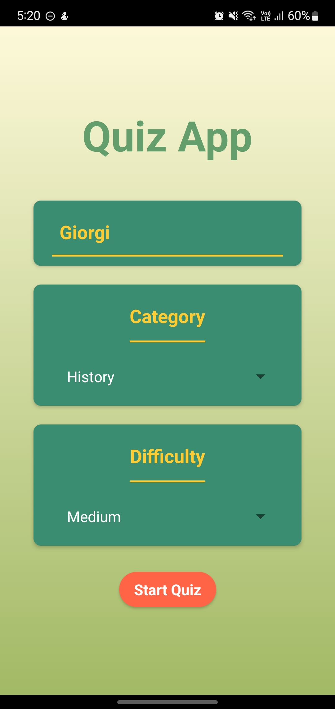
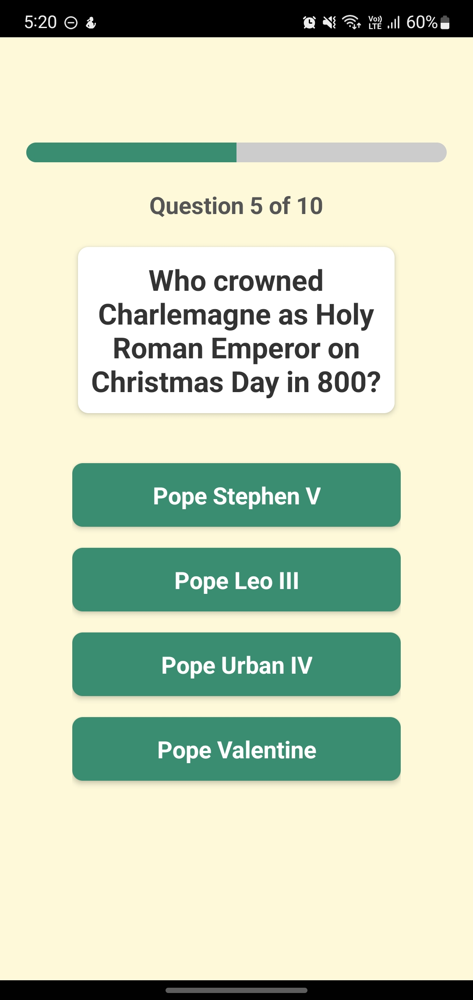
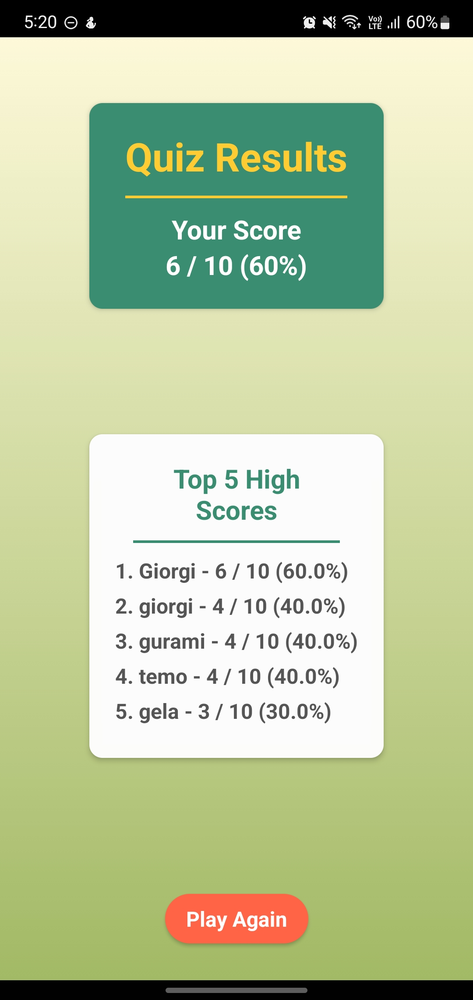

# React Native Quiz App

  

## 📱 Screenshots

<table>
  <tr>
    <td></td>
    <td></td>
    <td></td>
  </tr>
</table>

## 📌 Overview

This is a React Native quiz application that allows users to select a quiz category and difficulty level, answer multiple-choice questions fetched from the OpenTDB API, and receive a score at the end. The app is designed with a clean and intuitive UI, optimized for performance, and follows best coding practices.

## 🚀 Features

- Fetches quiz questions from the **OpenTDB API**
- Users can **select a category and difficulty level** before starting the quiz
- Displays **multiple-choice questions** with real-time feedback
- **Tracks and displays the final score**
- **Allows users to restart** the quiz
- Optimized performance with ** React.memo, useMemo, and useCallback**
- Accessible and mobile-friendly UI

## 🛠️ Technologies Used

- **React Native** (Expo)
- **React Navigation** for screen transitions
- **React Native Testing Library & Jest** for unit testing

## 🔧 Installation & Setup

1. Clone the repository:
   ```sh
   git clone https://github.com/yourusername/quiz-app.git
   cd quiz-app
   ```
2. Install dependencies:
   ```sh
   npm install
   ```
3. Start the development server:
   ```sh
   npm start
   ```

## ✅ Testing

Run unit tests using Jest & React Native Testing Library:

```sh
npm test
```

## 📈 Performance Optimizations

- **React Navigation** for screen transitions
- **Memoization** with `React.memo`, `useMemo`, and `useCallback`
- **FlatList optimizations** for efficient rendering
- **Minimal re-renders** by optimizing state updates

🔥 **Enjoy coding & happy learning!** 😊
